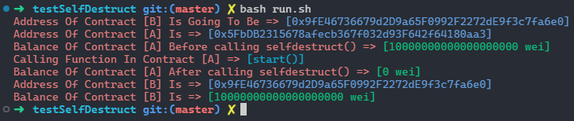

# Question
- ### we have contract A which the balance of contract is 10 ether and there is a function in it which call selfdestruct() and we pass an payable address to the function. but, there is no deployed contract on that address. what will be happen to the ethers ?

<br>

# Answer
- ### ethers will be in pending mode and waiting for the contract to be deployed on that address

<br>

# How ?
- ### Run :
    - ```bash
      # Put your data in .env.example File
      # Then rename it to .env
      bash run.sh
      ```
- ### Result
    - 
