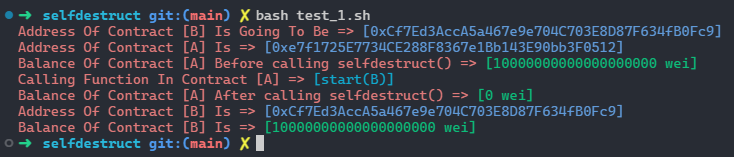
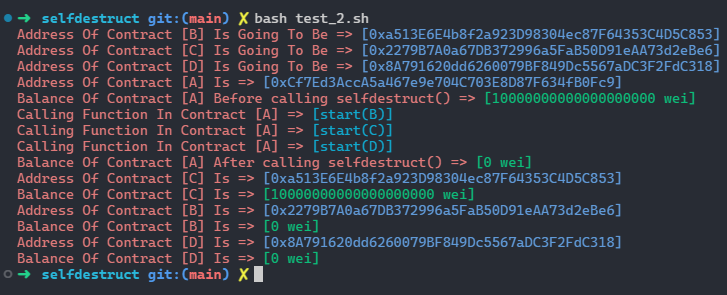
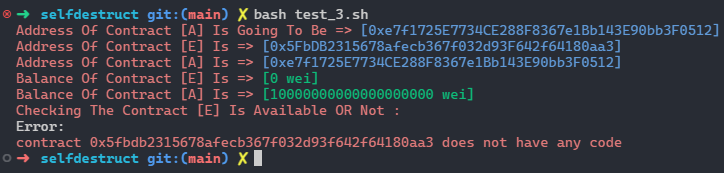

# Answering Some Question About `selfdestruct()`

- #### (Q) we have contract `A` which the balance of contract is `10 ether` and there is a function in it which call `selfdestruct()` and we pass an payable address to the function. but, there is `no deployed contract` on that address. what will be happen to the `ethers` ?

    - #### (A) ethers will be in pending mode and waiting for the contract to be deployed on that address

- #### Run :
    - ```bash
      # Put your data in .env.example File
      # Then rename it to .env
      bash test_1.sh
      ```

- #### Result :
    

---

- #### (Q) if we call `slefdestruct()` function several times and pass different address each time and no deployed contract be on that addreses, what will happen to the `ethers` ?

    - #### (A) ethers will be in pending mode (ok, we know this) and waiting for the first address which a contract deploy on it

- #### Run :
    - ```bash
      # Put your data in .env.example File
      # Then rename it to .env
      bash test_2.sh
      ```

- #### Result :
    

---

- #### (Q) after calling `selfdestruct()`, the contract which the function is in it, must not be available but in the past tests it is available. how can we implement this to delete the contract and send ethers force ?

    - #### (A) you must call selfdestruct() in the constructor of the contract which is going to send ethers. then pass the address of contract which is going to receive ethers.

- #### Run :
    - ```bash
      # Put your data in .env.example File
      # Then rename it to .env
      bash test_3.sh
      ```

- #### Result :
    
